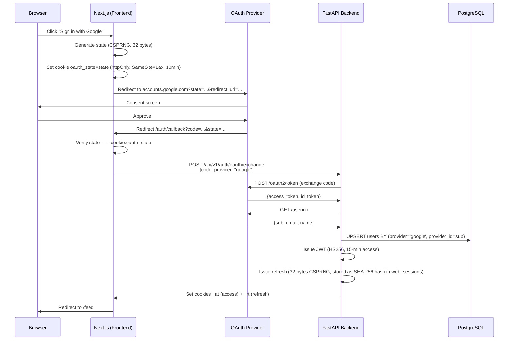

# Case Study: 7-provider OAuth + JWT + guest sessions

*Notes from building the auth layer for [HoneyChat](https://honeychat.bot) — a web-first AI companion platform with Telegram integration. Unlike Snapshot's on-chain signature model, web AI companions need traditional OAuth plus account-continuity patterns (guest → registered).*

**Stack**: Next.js 15.1 (App Router, frontend) · FastAPI + SQLAlchemy async (backend) · PostgreSQL · Redis

---

## Why 7 OAuth providers, not 1 or 2

Many AI companion sites ship with 1–2 OAuth options plus email. HoneyChat's target languages (17 UI locales) span very different OAuth ecosystems:

| Region | Dominant OAuth |
|---|---|
| US / EU / LATAM | Google, Discord, Twitter/X |
| RU / CIS | Yandex |
| Japan | Line |
| Korea | Kakao |
| Telegram-native users | Telegram Login Widget (bot `@HoneyChatAIBot`) |

"Sign in with Google" works fine in the US. In Japan or Korea, users abandon if Line/Kakao isn't offered. Without Yandex, RU/KZ users fall back to email + password with higher dropoff.

---

## Flow 1: Standard OAuth (Google / Discord / Twitter / Yandex / Line / Kakao)

Cookie-bound state validation per [RFC 6749 §10.12](https://datatracker.ietf.org/doc/html/rfc6749#section-10.12) — crucial: state is generated client-side (in Next.js), stored in an httpOnly cookie, and verified client-side on callback. We do **not** store state in a server-side Redis endpoint; the backend just validates the final code exchange.



### Key decision: state stays client-side

Tempting to store state in server Redis, but it adds a round-trip and a failure mode (Redis down = login broken). Cookie-bound state:
- No extra storage
- Works even if backend is down during redirect
- Still secure (attacker can't read httpOnly cookie)

---

## Flow 2: Telegram Login Widget

Different from OAuth — Telegram uses a signed hash instead of access_token:

```python
import hmac, hashlib

def verify_telegram_auth(data: dict, bot_token: str) -> bool:
    """Telegram sends user data signed with SHA-256 of bot token."""
    received_hash = data.pop("hash")
    data_check = "\n".join(f"{k}={v}" for k, v in sorted(data.items()))
    secret_key = hashlib.sha256(bot_token.encode()).digest()
    computed = hmac.new(secret_key, data_check.encode(), hashlib.sha256).hexdigest()
    return hmac.compare_digest(computed, received_hash)
```

If valid, upsert user by `(provider='telegram', provider_id=tg_user_id)`. Same unified users table — the user is the same whether they come via web OAuth or Telegram bot.

---

## Flow 3: Guest sessions (zero-friction onboarding)

The most impactful retention decision: let users chat **before** registering. Guest sessions live in Redis only:

```
Key: guest:{uuid}
Value: JSON {created_at, user_agent, language, last_active}
TTL: 86400 (24h)
```

When a guest decides to register:

```python
async def convert_guest_to_user(guest_id: str, registration_data: dict) -> User:
    async with db.begin():
        user = await create_user(**registration_data)
        # Migrate guest session's chat history (Redis → Postgres)
        guest_data = await redis.get(f"guest:{guest_id}")
        if guest_data:
            history = await redis.zrange(f"chat:guest:{guest_id}", 0, -1)
            await db.execute(
                "INSERT INTO messages (user_id, ...) VALUES ...",
                [...],  # batch insert
            )
            await redis.delete(f"guest:{guest_id}", f"chat:guest:{guest_id}")
    return user
```

The migration has to be atomic — partial migration = lost messages = user complaint. Use `FOR UPDATE` locks on the new user row.

---

## Refresh token storage (never plaintext)

Refresh tokens are **the most valuable credential** — they bypass 2FA and give long-lived access. Never store as plaintext:

```sql
CREATE TABLE web_sessions (
    id UUID PRIMARY KEY,
    user_id BIGINT REFERENCES users,
    refresh_token_hash BYTEA NOT NULL,  -- SHA-256 of the token
    issued_at TIMESTAMPTZ NOT NULL,
    last_used_at TIMESTAMPTZ NOT NULL,
    user_agent TEXT,
    ip_inet INET,
    revoked_at TIMESTAMPTZ
);
```

On refresh request:

```python
incoming_hash = hashlib.sha256(refresh_token.encode()).digest()
session = await db.fetch_one(
    "SELECT * FROM web_sessions WHERE refresh_token_hash = $1 AND revoked_at IS NULL",
    incoming_hash,
)
```

If leaked database dump, attacker has hashes, not tokens. Rotation on each refresh (new random token + hash, revoke old) limits replay window.

---

## What doesn't work

- **Don't share a single "session" cookie across subdomains without care.** `honeychat.bot` and `app.honeychat.bot` have different security postures; use distinct cookies.
- **Don't auto-log-in guests after conversion.** They expect a fresh "logged in as X" experience — confusing state if you silently re-use the guest session.
- **Don't rely only on email uniqueness.** Users sign up with Google (email=a@gmail.com) then later with email/password (same a@gmail.com) → duplicate accounts. Merge by verified email, but ask permission first.

---

## If you're building similar

The HoneyChat landing ([honeychat.bot](https://honeychat.bot)) and GitHub ([sm1ck/honeychat](https://github.com/sm1ck/honeychat)) have the full architecture — not just auth. Telegram bot side is [@HoneyChatAIBot](https://t.me/HoneyChatAIBot); same user account works across both.

For reference on Snapshot-style off-chain signature flows (different but related mental model — proving authorship without revealing keys), see the [main voter README](../../readme.md) in this repo.

---

**Author**: [@sm1ck](https://github.com/sm1ck) · [t.me/haruto_j](https://t.me/haruto_j)
